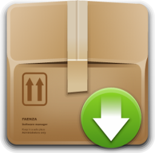
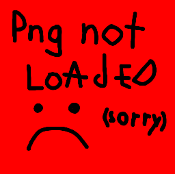

# Icon Sources

 

./Icon.png from [Faenza Icon Library](https://iconduck.com/sets/faenza-icon-library)

./Icons-\*/Download.png from [Open iconic icon set](https://iconduck.com/sets/open-iconic-icon-set)

./Icons-\*/Error.png from [Dev UI icon library](https://iconduck.com/sets/devui-icon-library)

./Icons-\*/Install.png from [Groomet Icons](https://iconduck.com/sets/grommet-icons)

./Icons-\*/Save.png from [Font Awesome Icons](https://iconduck.com/sets/font-awesome-icons)

./Icons-\*/Dev.png from [Font Awesome Icons](https://iconduck.com/sets/font-awesome-icons)

./Icons-\*/Info.png from [Google Material Design Icons](https://iconduck.com/sets/google-material-design-icons)

./Placeholder.png from [me :D](https://www.github.com/Tom5521)

**Note:** The dark icons are only the light icons with the colors inverted so they share authorship.
